## 传输介质

### 传输介质（有线）

#### 双绞线

双绞线由两根相互绝缘的铜导线按一定密度螺旋绞合而成，绞合可有效降低电磁干扰。按有无屏蔽层分为屏蔽双绞线（STP）和非屏蔽双绞线（UTP），UTP 成本低、柔性好，使用最广。以太网常用 Cat5e（支持 1000Mbps）、Cat6（支持 10Gbps 短距离）。最大传输距离通常为 100 米，超过需用中继器或交换机，RJ-45 接头是其标准接口。

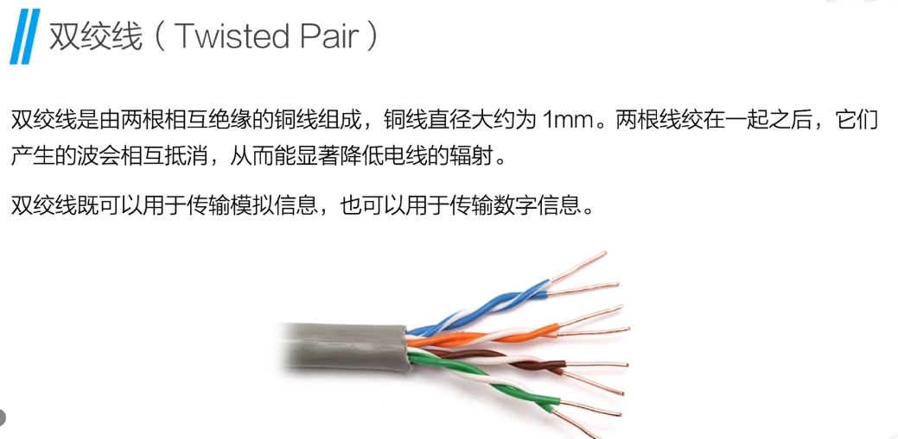
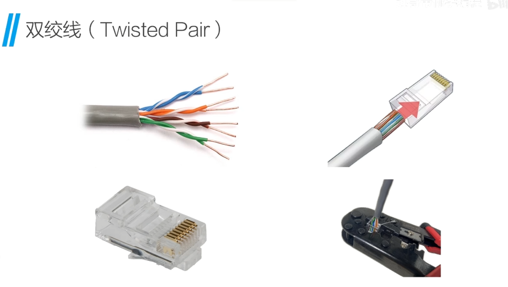
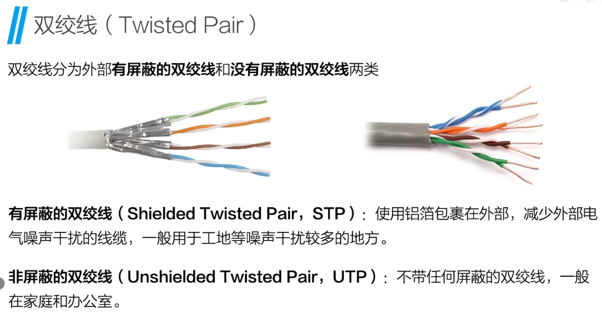
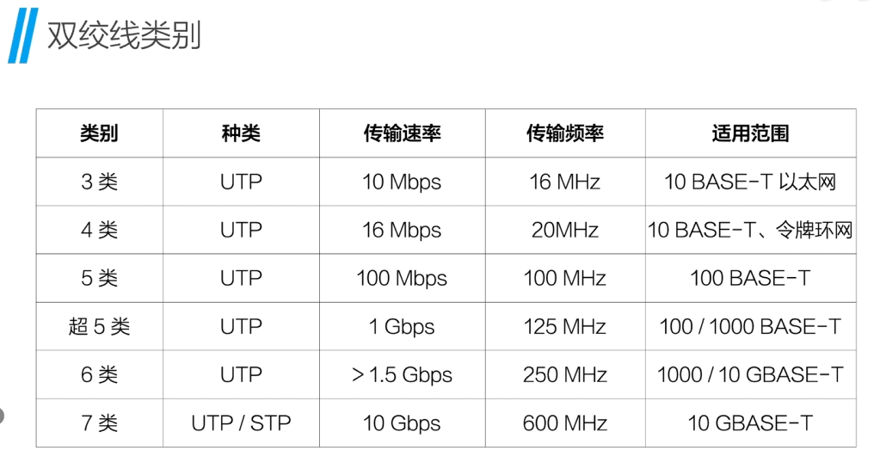

#### 光纤

光纤利用光在纤芯与包层之间的全反射原理传输光信号，由纤芯、包层和护套三层构成。单模光纤（芯径约 9μm）使用激光源，光沿直线传播，带宽极高、传输距离可达数十公里，用于长途骨干网；多模光纤（芯径约 50/62.5μm）使用 LED 光源，存在模式色散，距离限于几百米，用于局域网。光纤不受电磁干扰、安全性高，但连接和分接成本较高。

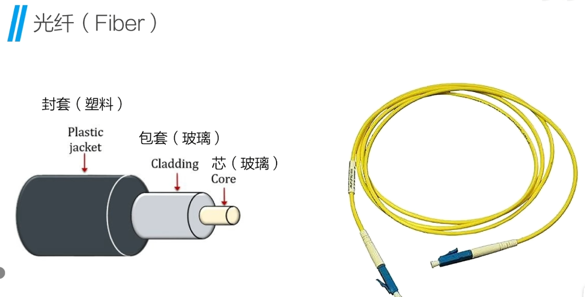
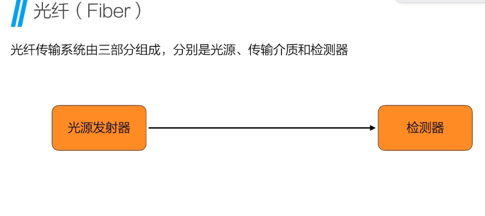
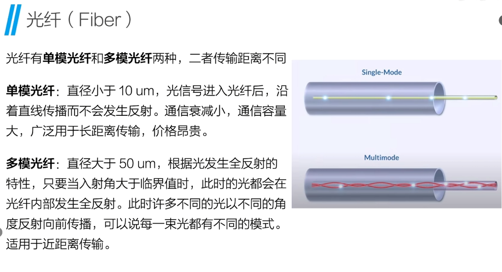

#### 同轴电缆

同轴电缆由内向外依次为铜质芯线、绝缘层、金属编织网状屏蔽层、塑料护套——同轴结构使电磁场封闭在内部，屏蔽性能优异。早期以太网的 10BASE5"粗缆"和 10BASE2"细缆"使用同轴电缆作为总线型介质，后因故障排查困难、布线不灵活被双绞线取代。如今主要用于有线电视网络（HFC 混合光纤同轴网）的接入段。

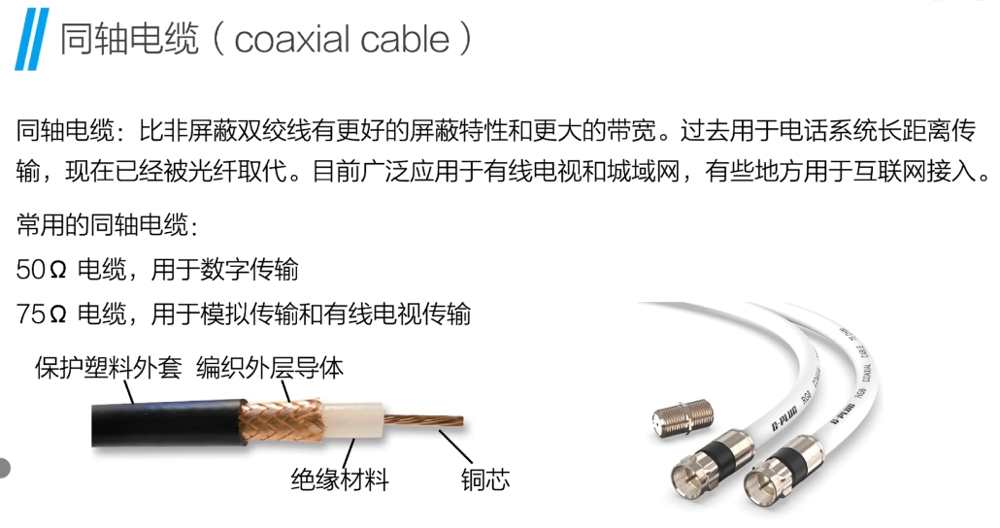

### 传输介质（无线）

无线传输介质利用电磁波在自由空间（大气、真空）中传播数据信号，无需架设物理线缆，适用于移动通信、卫星通信及不易布线场景。常见类型：无线电波（Wi-Fi 2.4G/5GHz、蓝牙 2.4GHz，穿墙能力强）、微波（地面接力与卫星通信，方向性强、带宽高）、红外线（短距直线传输、不穿墙、安全性高）、激光通信（点对点高速、受天气影响大）。

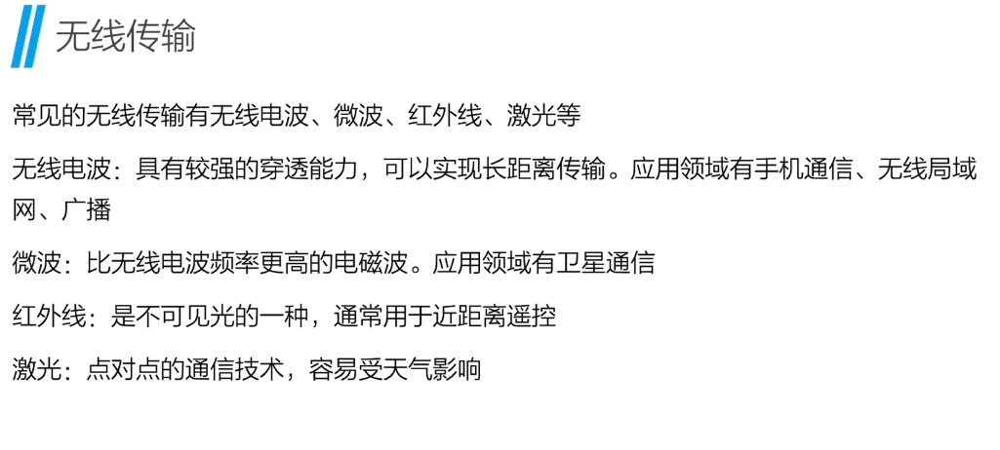

### 传输标准命名标准

IEEE 802.3 以太网传输标准的命名遵循固定规则：<速率><调制方式><介质或附加信息>。首段数字表示速率（Mbps 或 Gbps，如 10、100、1000）；BASE 表示基带传输（数字信号直接传输，不调制到载波），高速标准也有 BROAD（宽带）；后缀标识物理介质或传输距离：T 为双绞线（100BASE-TX），F/FX 为光纤（100BASE-FX），C 为铜缆，数字可能表示最大段长。

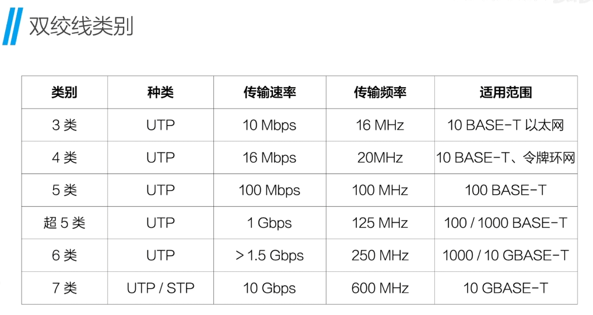
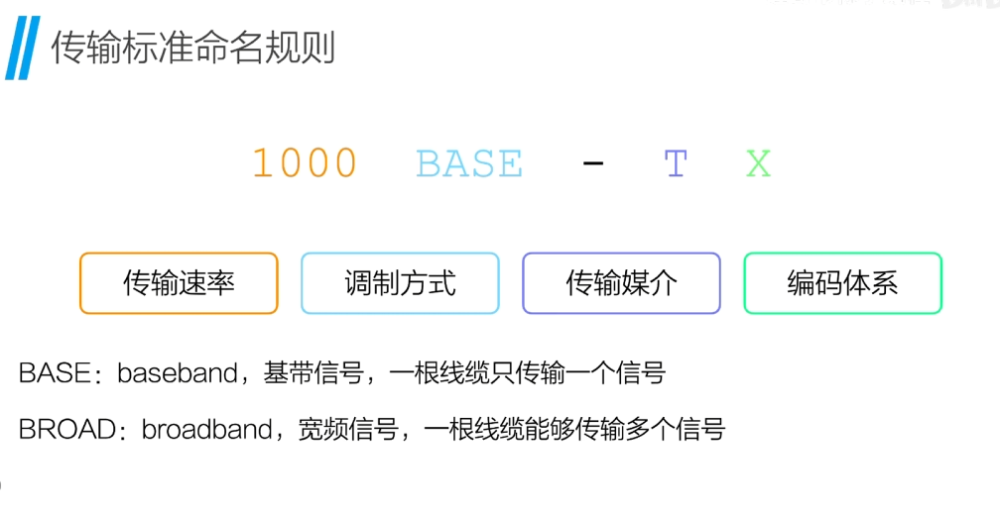
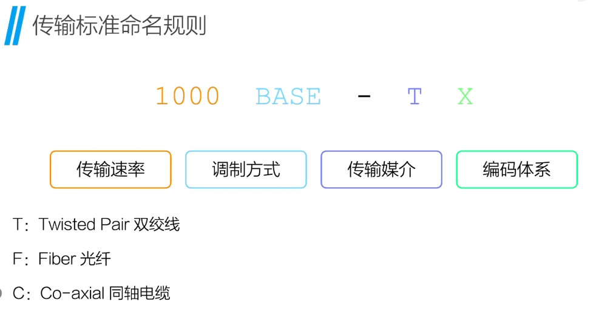

### 编码

#### 归零编码

归零编码（RZ）在每个比特周期的后半段信号强制归零。发送 1 时前半段为正电平后归零，发送 0 时前半段为负电平后归零。每个比特都有电平跳变，接收方可以从信号中提取时钟自同步。但其编码效率仅 50%（每比特至少跳变两次），带宽利用率低，实际网络协议很少直接采用。

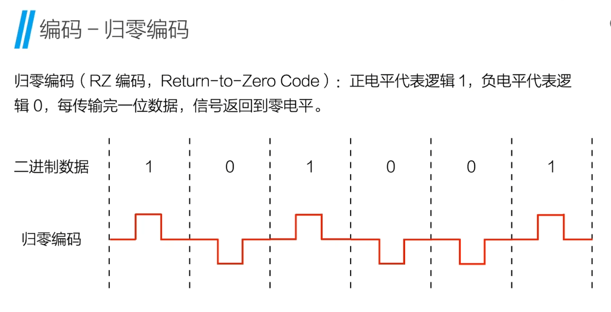

####  不归零编码

不归零编码（NRZ）在整个比特周期保持电平不变：高电平表示 1，低电平表示 0。NRZ 编码最简单、实现成本最低，但存在严重缺陷——当连续发送多个相同比特时，信号电平长时间不变，接收方无法从信号中恢复时钟，导致收发双方的比特边界发生偏移（时钟漂移），因此很少单独使用，通常配合其他编码技术。

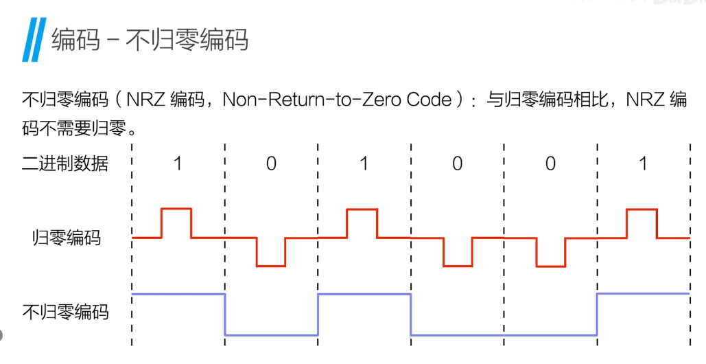

#### 反向不归零编码

反向不归零编码（NRZI）是一种差分编码方案：遇到比特 0 时信号电平翻转（从高到低或低到高），遇到比特 1 时电平保持不变。相比 NRZ，NRZI 对信号极性的绝对意义不敏感，只需检测跳变而非绝对电平，抗干扰能力更强。USB 协议采用 NRZI 编码，并配合位填充技术（连续 6 个 1 后插入一个 0）解决长序列同值比特无法同步的问题。

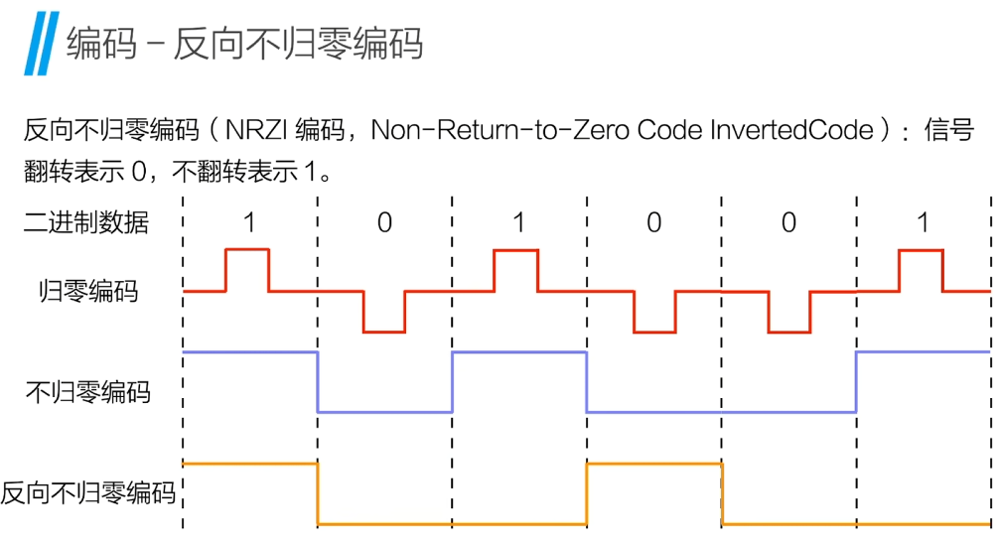

#### 曼彻斯特编码

曼彻斯特编码在每个比特周期的正中间发生一次电平跳变，跳变方向同时表示数据值和提供时钟同步。高电平跳变到低电平表示比特 1，低电平跳变到高电平表示比特 0。每个比特必然有一次跳变，接收端可从中准确提取时钟信号实现自同步。代价是跳变频率加倍，所需带宽是 NRZ 的两倍。10Mbps 以太网（10BASE-T）采用该编码。

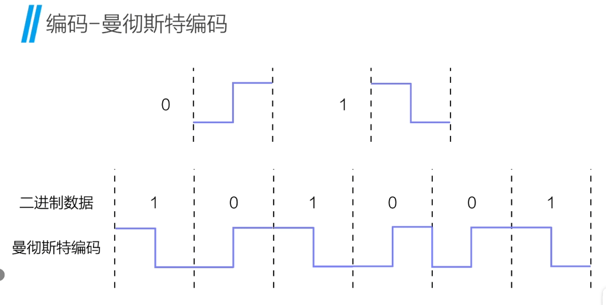

#### 差分曼彻斯特编码

差分曼彻斯特编码每比特中间位同样发生跳变用于时钟同步，但数据判定方式不同：比特开始边界处有跳变表示 0，无跳变表示 1。采用差分方式编码（关心是否跳变而非绝对电平），对信号极性反转不敏感，抗干扰能力更强。令牌环网（Token Ring，IEEE 802.5）采用该编码，适合环型拓扑的逐站转发模式。

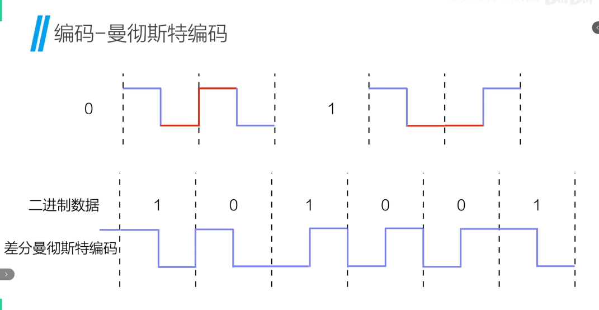

#### 4B/5B 编码（*）

4B/5B 编码将每 4 位数据映射为 5 位码字，从 32 种编码组合中选取 16 种传输数据，其余用于控制信息。通过精心选择编码表，保证输出码字不会出现连续 3 个以上的 0，提供足够跳变频率供接收端时钟恢复。编码效率为 80%（远高于曼彻斯特的 50%），在 100Mbps 以太网（100BASE-TX 和 100BASE-FX）中广泛使用，编码后再经 NRZI 线路传输。

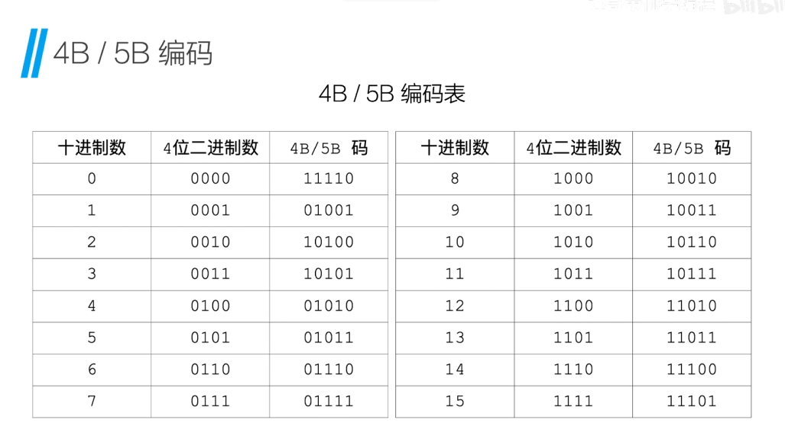

## 例题

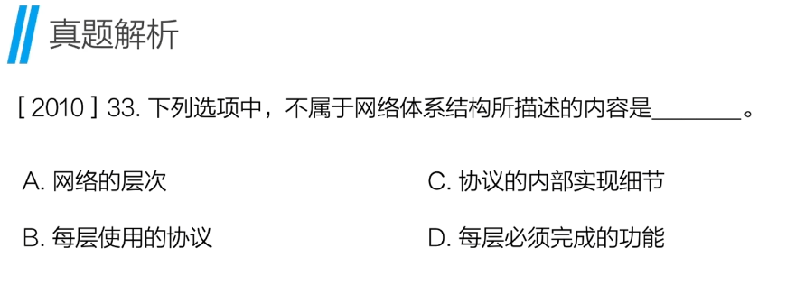

C

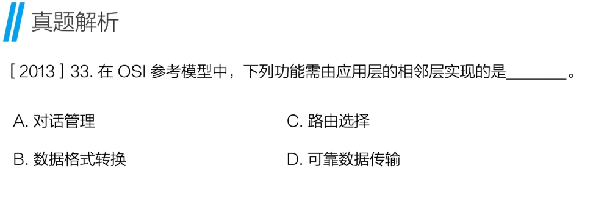

B

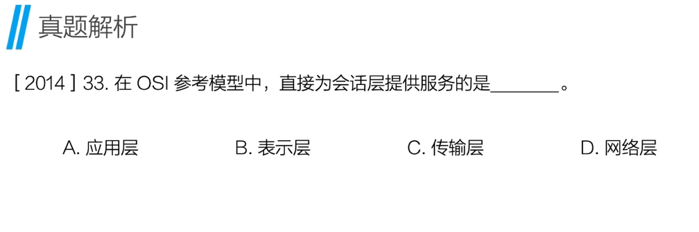

C

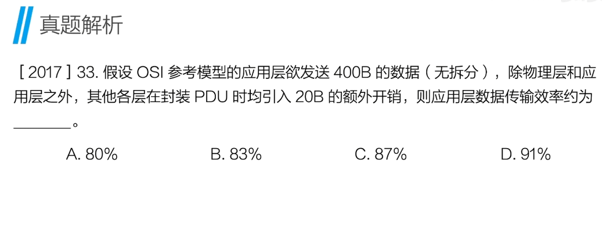

C

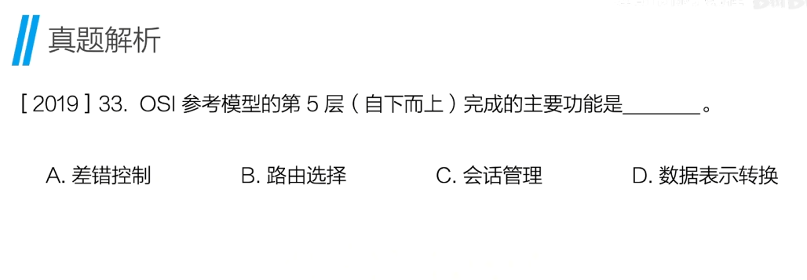

C

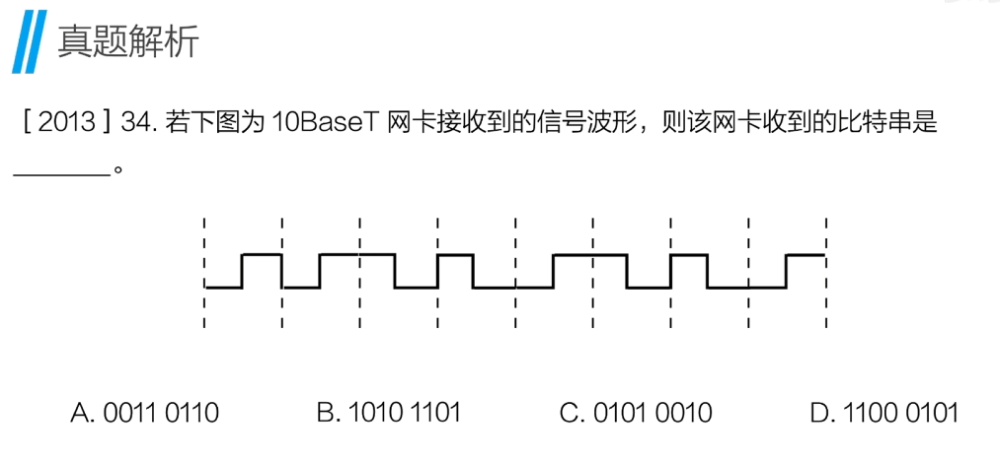

A

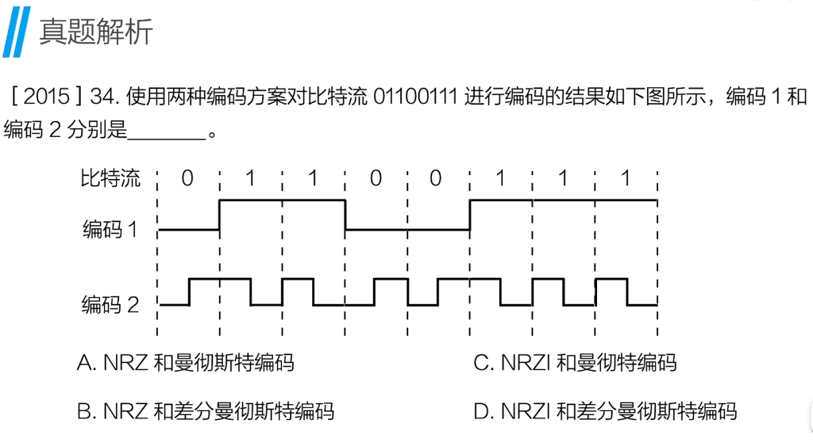

A

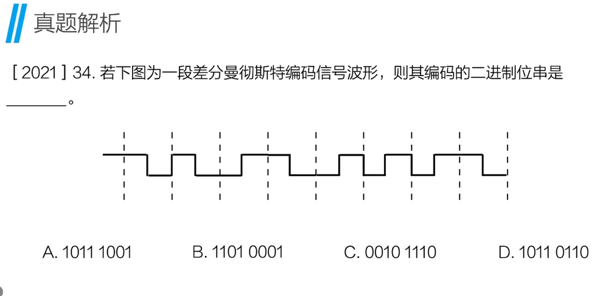

A
